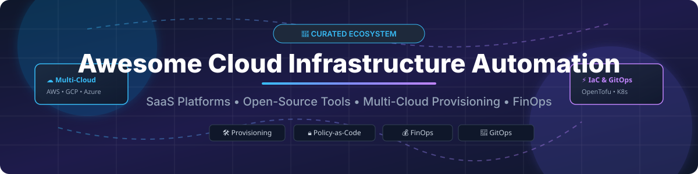

# ☁️ Awesome Cloud Infrastructure Automation 🚀

  
  
  
  
  

## 📌 Overview & SEO Summary

Welcome to the definitive, curated directory of **Cloud Infrastructure Automation Platforms**, **Infrastructure-as-Code (IaC) Orchestration Tools**, **GitOps Control Planes**, and **FinOps Cloud Management Solutions**. 

Whether you are building platform engineering self-service portals, orchestrating multi-cloud environments (AWS, GCP, Azure, Kubernetes), enforcing Policy-as-Code (OPA, Sentinel), or managing cloud cost optimization, this list highlights both leading SaaS products and production-grade open-source GitHub projects.

---

## 📑 Table of Contents

- [☁️ SaaS & Hosted Cloud Infrastructure Platforms](#%EF%B8%8F-saas--hosted-cloud-infrastructure-platforms)
- [🔓 Open-Source GitHub Projects](#-open-source-github-projects)
- [🤝 How to Contribute](#-how-to-contribute)
- [💖 Support & Community](#-support--community)
- [⚠️ Disclaimer](#%EF%B8%8F-disclaimer)
- [📈 Star History](#-star-history)

---

## ☁️ SaaS & Hosted Cloud Infrastructure Platforms

### 📊 Market Size & Fragmentation Dynamics
> 💡 **Market Insights**: The global Cloud Infrastructure Automation and Cloud Management Platform (CMP) sector is estimated at **$18.5 Billion** and is projected to reach **$42 Billion by 2030** (CAGR ~17.5%). The market is **moderately fragmented**, balancing enterprise hyper-scaler acquisitions (e.g., HPE acquiring Morpheus Data, IBM acquiring HashiCorp) alongside high-growth specialized IaC & GitOps automation platforms (Spacelift, env0, Scalr).

Below is a comparative breakdown of top commercial cloud infrastructure automation SaaS platforms, sorted by **Company Size / Valuation / Revenue** in descending order:

| SaaS Platform | Description | Starting Price (Paid Tier) | Free Tier Limits / Free Trial | Company Size (Valuation / Revenue) |
| :--- | :--- | :--- | :--- | :--- |
| **[Flexera CMP](https://www.flexera.com/)** | Enterprise hybrid IT & cloud management platform providing multi-cloud governance, automated provisioning, and cost optimization. | Custom enterprise quotes (~$25,000/year minimum starting package) | 30-day full-feature enterprise free trial (no credit card required) | **$3.0 Billion+ Valuation** (Acquired by Thoma Bravo; $600M+ ARR) |
| **[Terraform Cloud](https://www.hashicorp.com/products/terraform)** (HashiCorp / IBM) | Managed Terraform platform offering remote execution, private module registry, drift detection, and governance. | **$0.00014 per resource-hour** (~$0.10/resource-month after free tier) | **Free Forever**: Up to 500 managed resources per month | **$6.4 Billion** (Acquired by IBM in 2024; $580M+ ARR) |
| **[Morpheus Data](https://morpheusdata.com/)** (HPE) | Hybrid cloud management platform providing self-service provisioning, enterprise orchestration, and FinOps across hybrid clouds. | **$24,999/year** starting tier for enterprise control plane | 30-day enterprise proof-of-concept (PoC) free trial | **~$150 Million Valuation** (Acquired by HPE in August 2024; ~$11.6M ARR) |
| **[Spacelift](https://spacelift.io/)** | Infrastructure orchestration platform for Terraform, OpenTofu, Pulumi, CloudFormation, and Ansible with policy-as-code. | **$250/month** (Starter tier, includes 2 concurrent runs & 500 managed resources) | 14-day free trial with full access & 200 free build minutes | **~$120 Million Valuation** ($18M Series B; ~$10M ARR) |
| **[CloudBolt](https://www.cloudbolt.io/)** | Hybrid cloud management platform with automated provisioning, self-service IT, FinOps, and multi-cloud governance. | **$15,000/year** base enterprise license | 30-day interactive sandbox & enterprise free trial | **~$100 Million Valuation** (Private equity backed; ~$18M ARR) |
| **[env0](https://www.env0.com/)** | Infrastructure-as-Code automation platform providing self-service environments, cost control, and approval workflows. | **$349/month** (Pro tier, includes 3 concurrencies & unlimited users) | **Free Forever**: 1 concurrency, up to 100 deployments/month | **~$80 Million Valuation** ($35M Series B; ~$6M ARR) |
| **[Scalr](https://scalr.com/)** | OpenTofu & Terraform remote operation platform featuring hierarchical state management, OPA policies, and cost estimation. | **$99/month** (Team plan, includes 5 workspaces & policy enforcement) | **Free Forever**: Up to 50 managed runs per month | **~$50 Million Valuation** (Bootstrapped/Private; ~$8M ARR) |
| **[Quali Torque](https://www.quali.com/)** | Environment-as-a-Service (EaaS) platform enabling self-service infrastructure provisioning with strict governance. | **$1,000/month** (Base SaaS tier for application environments) | 30-day free trial for up to 5 active environments | **~$45 Million Valuation** ($22M Venture Funding; ~$5M ARR) |
| **[Cloudify](https://cloudify.co/)** (Dell) | TOSCA-based cloud orchestration platform providing multi-cloud environment management and network function virtualization. | Custom enterprise quotes (starting ~$12,000/year) | 30-day free trial on Cloudify SaaS / Community self-hosted edition | **~$40 Million Valuation** (Acquired by Dell Technologies in 2023) |
| **[StormForge](https://www.stormforge.io/)** | Kubernetes resource optimization platform using machine learning for rightsizing and performance auto-tuning. | **$8 per vCPU/month** (Optimize Live starting tier) | 30-day free trial for up to 10 Kubernetes clusters | **~$35 Million Valuation** ($19M Series B Funding; ~$4M ARR) |

---

## 🔓 Open-Source GitHub Projects

Explore production-grade open-source tools for cloud provisioning, IaC execution, multi-cluster management, and configuration automation. Sorted by **GitHub Stars_Count** (descending):

| Open-Source Project | Description | GitHub_Stars |
| :--- | :--- | :--- |
| 🛠️ **[Ansible](https://github.com/ansible/ansible)** | Foundational IT and cloud infrastructure automation platform for configuration management and application deployment. |  |
| 🏗️ **[HashiCorp Terraform](https://github.com/hashicorp/terraform)** | Original declarative Infrastructure-as-Code tool for provisioning cloud and on-premises infrastructure. |  |
| 🔓 **[OpenTofu](https://github.com/opentofu/opentofu)** | CNCF open-source fork of Terraform enabling declarative cloud infrastructure provisioning with full compatibility. |  |
| ⚡ **[Pulumi](https://github.com/pulumi/pulumi)** | Infrastructure-as-Code SDK allowing engineers to declare cloud infrastructure using real programming languages (Go, TS, Python). |  |
| 🎯 **[Crossplane](https://github.com/crossplane/crossplane)** | CNCF cloud-native control plane framework enabling platform engineering teams to build custom infrastructure CRDs in Kubernetes. |  |
| 🤖 **[Atlantis](https://github.com/runatlantis/atlantis)** | Self-hosted Terraform and OpenTofu Pull Request automation tool for team GitOps collaboration via GitHub webhooks. |  |
| 📐 **[Terramate](https://github.com/terramate-io/terramate)** | Stack orchestration and code generation tool for managing large-scale Terraform and OpenTofu monorepos with DAG workflows. |  |
| 📦 **[Terrakube](https://github.com/terrakube-io/terrakube)** | Complete open-source Terraform & OpenTofu collaboration platform with private registry, workspace state management, and OPA/Infracost. |  |
| ☸️ **[k0rdent](https://github.com/k0rdent/k0rdent)** | CNCF Kubernetes-native multi-cluster management platform featuring built-in FinOps (OpenCost) and VictoriaMetrics observability. |  |
| 🌐 **[CB-Tumblebug](https://github.com/cloud-barista/cb-tumblebug)** | Multi-cloud infrastructure orchestration framework supporting automated VM provisioning, networking, and MCP AI assistant integration. |  |
| 🧩 **[OpenMCF](https://github.com/plantonhq/openmcf)** | Multi-cloud deployment framework bringing Kubernetes Resource Model (KRM) structure across 360+ deployment components and 17 cloud providers. |  |

---

## 🤝 How to Contribute

We welcome contributions from DevOps engineers, platform teams, and cloud architects!

1. 🍴 **Fork** this repository.
2. 📝 Add or update entries in `README.md` following the tabular format.
3. 🔎 Ensure pricing, free tier details, and company sizing metrics are accurate.
4. 🚀 Submit a **Pull Request** with a descriptive summary of your changes.

Check out our curated list meta-collection at [Awesome-Awesome-Awesome](https://github.com/ishandutta2007/Awesome-Awesome-Awesome).

---

## 💖 Support & Community

If you find this repository helpful, please consider supporting the project:

- ⭐ **Star** this repository to help others discover it!
- 🔀 **Fork** it to keep your own reference copy.
- 📢 **Share** it with your DevOps and platform engineering colleagues.
- ☕ **Sponsor**: Buy me a coffee via the [GitHub Sponsor Dashboard](https://github.com/sponsors/ishandutta2007)!

---

## ⚠️ Disclaimer

- This directory is a **community-curated list** provided for educational and decision-making context.
- Pricing details, valuation metrics, and tier limits are based on publicly available data as of September 2026 and are subject to vendor updates.
- Ensure proper governance, secrets encryption, and access controls when executing IaC pipelines across production infrastructure.

---

## 📈 Star History

---

Made with ❤️ for platform engineers, infrastructure architects, and cloud operations teams worldwide.

